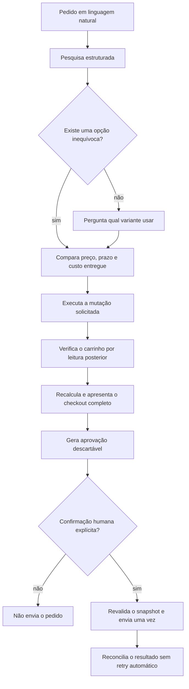
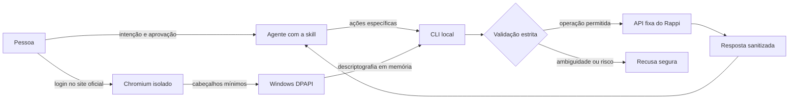

<div align="center">

# rappi-skill

**Uma skill para agentes pesquisarem, compararem e comprarem no Rappi com segurança — sem depender de navegador para cada passo.**

[](https://bun.sh/)
[](https://nodejs.org/)
[](https://www.microsoft.com/windows)
[](#testes)
[](#limitações)

Transforme pedidos em linguagem natural em pesquisas, comparações de cesta e compras supervisionadas — mantendo credenciais fora do contexto do agente.

</div>

> [!IMPORTANT]
> Projeto independente e não oficial. Ele usa APIs do cliente web do Rappi Brasil, que podem mudar sem aviso.

---

## Por que este projeto existe

1- Pedir comida é bem chato se você já sabe exatamente oque você quer

2- Depender de *computer use* para cada etapa de uma compra é lento, caro e frágil. Além de gastar tokens interpretando telas, um agente pode selecionar a variação errada, perder contexto entre páginas ou repetir um pedido depois de uma falha — erros que queimam tempo e dinheiro.

O `rappi-skill` tira o navegador do caminho crítico. O agente trabalha com dados estruturados, a CLI limita e verifica cada operação, e nenhuma compra acontece sem aprovação humana explícita.

## O que você pode pedir ao agente

### Encontrar exatamente o produto que você quer

> “Procure café em grãos de 500 g e me mostre as opções com menor custo entregue.”

O agente pode pesquisar por nome ou EAN, separar tamanhos e variantes, ignorar produtos indisponíveis e organizar os resultados por preço, prazo ou custo entregue estimado. Quando houver opções parecidas, ele apresenta as diferenças em vez de escolher silenciosamente por você.

### Comparar o preço real de uma cesta

> “Compare quanto fica essa lista em uma loja só e dividida em até duas lojas.”

O menor preço de etiqueta nem sempre produz a cesta mais barata. O agente considera quantidade, pedido mínimo, desconto, frete, taxa de serviço, cobranças obrigatórias e gorjeta solicitada. O otimizador compara a melhor cesta de uma loja com divisões viáveis entre lojas.

### Montar e editar o carrinho

> “Adicione duas unidades daquela opção de 500 g da Loja A.”

Depois que o produto está identificado sem ambiguidade, o agente pode adicionar, atualizar ou remover itens. A CLI preserva o restante do carrinho e confirma a mutação lendo o estado devolvido pela API.

Se existirem sabores, tamanhos ou SKUs diferentes e você não tiver escolhido um, o agente pergunta. “Pede dois” nunca significa “escolha qualquer um”.

### Conferir tudo antes de comprar

> “Revise meu carrinho e mostre o total final antes de fazer o pedido.”

O agente compara o carrinho inteiro com o que foi solicitado na conversa e aponta itens extras, quantidades maiores ou lojas inesperadas. Em seguida, mostra:

- cada loja, produto e quantidade;
- subtotal e descontos;
- frete, taxa de serviço e cobranças obrigatórias;
- gorjeta selecionada;
- total final;
- rótulo do endereço;
- janela de entrega;
- método de pagamento mascarado.

Nada é tratado como aprovado só porque já estava no carrinho.

### Escolher endereço e pagamento sem expor dados sensíveis

> “Use meu endereço Casa e o cartão salvo com alias Principal.”

O agente pode listar rótulos de endereço e cartões mascarados, mas nunca deve mostrar endereço completo, coordenadas, número de cartão, token ou identificador interno de pagamento. Qualquer alteração exige uma escolha clara e exata.

### Fazer o pedido somente depois da sua confirmação

> “Pode confirmar exatamente esse checkout.”

O agente gera uma aprovação descartável vinculada ao conteúdo exato que você revisou. Depois, apresenta novamente o resumo e espera uma confirmação explícita em uma nova mensagem.

Se item, quantidade, loja, preço, taxa, desconto, gorjeta, endereço, horário ou pagamento mudar, a aprovação deixa de valer. Ela também só pode ser usada uma vez.

### Acompanhar um resultado incerto sem duplicar a compra

> “Veja se o pedido foi criado, mas não tente de novo.”

Se a conexão cair depois do envio, a CLI considera o resultado ambíguo e **não repete o checkout**. O agente consulta a listagem de pedidos e diferencia:

- **confirmado:** pedido, loja e valor foram reconciliados;
- **criado, mas não verificado:** o ID apareceu, porém faltam detalhes financeiros;
- **ambíguo:** há sinais de criação, mas não existe comprovação suficiente.

Isso evita transformar um timeout em dois pedidos cobrados.

## Exemplos de conversa

```text
Você: Encontre detergente neutro de 500 ml e compare pelo custo entregue.
Agente: Encontrei três variantes compatíveis em duas lojas. A opção A é mais
        barata por unidade, mas a opção B produz o menor total com frete.
```

```text
Você: Monte uma cesta com esses quatro produtos e use no máximo duas lojas.
Agente: A melhor cesta em uma loja custa R$ X. Dividindo entre duas lojas,
        o total fica R$ Y após mínimos e taxas, uma economia de R$ Z.
```

```text
Você: Adicione duas unidades da opção B e prepare o checkout.
Agente: Carrinho verificado. Antes de aprovar, encontrei um item antigo que
        não foi solicitado nesta conversa. Você quer removê-lo ou mantê-lo?
```

```text
Agente: Checkout recalculado e aprovação criada para este conteúdo exato.
        Total: R$ X. Pagamento: Principal •••• 0000. Posso enviar o pedido?
Você: Sim, pode enviar exatamente esse pedido.
Agente: Pedido enviado uma única vez. ID reconciliado e status confirmado.
```

## Como o agente trabalha



A skill principal está em [`skills/rappi-ordering/SKILL.md`](skills/rappi-ordering/SKILL.md). Ela ensina ao agente quando pesquisar, comparar, perguntar, executar ou recusar — a CLI é apenas a fronteira que garante que essas ações continuem restritas.

## O que o agente não deve fazer

- escolher uma variante ambígua por conta própria;
- adicionar produtos apenas para atingir pedido mínimo;
- substituir um item silenciosamente;
- assumir que itens antigos do carrinho foram autorizados;
- trocar endereço, pagamento, horário ou gorjeta como efeito colateral;
- mostrar credenciais, endereço completo ou detalhes internos de pagamento;
- comprar produtos regulados pelo fluxo genérico;
- tratar uma confirmação genérica como autorização de compra;
- repetir um pedido para “ver se agora funciona”.

## Por baixo do capô



O navegador é usado apenas no bootstrap de autenticação. As operações normais acontecem por uma CLI API-first com:

- origem de produção fixa;
- comandos específicos, sem proxy arbitrário;
- validação de identificadores, quantidades, valores e formatos;
- limites de timeout e tamanho de resposta;
- sanitização de texto remoto;
- sessão descriptografada somente em memória;
- aprovação atômica e de uso único para checkout.

<details>
<summary><strong>Ver interface da CLI</strong></summary>

```text
auth login|status|clear
search <query...> [--sort price|fastest|delivered] [--limit N] [--ean EAN] [--quantity N]
addresses list
addresses set <address-id>
cart get
cart add --query <query> --store-type <type> --store-id <id> --product-id <id> [--units N]
cart remove --store-type <type> --store-id <id> --product-id <id>
payments list --store-type <type> --store-id <id>
payments select --store-type <type> --store-id <id> --alias <saved-card-alias>
checkout preview --store-type <type>
checkout approve --store-type <type>
checkout cancel <approval-id>
order --store-type <type> --approval-id <approval-id>
orders list
```

</details>

## Instalação

### Requisitos

- Windows x64;
- [Bun](https://bun.sh/);
- conta válida no Rappi Brasil.

```bash
git clone git@github.com:bruno-1337/rappi-skill.git
cd rappi-skill
bun install
bun run setup
bun bin/rappi.mjs auth login
```

`auth login` abre o site oficial em um perfil isolado. Depois da autenticação, ele armazena apenas os cabeçalhos necessários usando Windows DPAPI e fecha o navegador. O procedimento detalhado está em [`operations.md`](skills/rappi-ordering/references/operations.md).

## Dados locais e credenciais

O estado sensível fica fora do repositório:

```text
%LOCALAPPDATA%/RappiConnector/
├── session.dpapi
├── approvals/
├── profile/
└── runtime/
```

Arquivos DPAPI só podem ser descriptografados pelo mesmo usuário do Windows. Sessões, aprovações, perfis de navegador, tokens e payloads de pagamento não devem ser copiados, exibidos ou versionados.

## Testes

```bash
bun test
```

A suíte possui **50 testes determinísticos e anonimizados**, sem acesso a contas reais e sem envio de pedidos. Ela cobre contratos da API, proteção da sessão, consumo atômico de aprovações, validação do carrinho, cálculo do checkout, reconciliação de pedidos e otimização de cestas.

Fixtures fictícias preservam a estrutura e as invariantes observáveis da API sem publicar dados pessoais ou credenciais.

## Estrutura

```text
bin/                         entrada restrita da CLI
src/                         cliente da API e regras de domínio
scripts/                     instalação do runtime local
skills/rappi-ordering/       comportamento do agente, referências e otimizador
test/                        testes determinísticos sem credenciais reais
```

## Limitações

- O armazenamento de sessão depende de Windows DPAPI.
- O runtime gerenciado do setup atualmente suporta apenas Windows x64.
- A API usada pode mudar sem versionamento público.
- A busca fornece estimativas; somente o checkout recalculado é autoritativo.
- Produtos regulados, medicamentos sob prescrição e itens com restrição de idade não devem usar o fluxo genérico.
- Um resultado ambíguo precisa ser conferido no histórico ou aplicativo oficial; repetir o checkout não é uma recuperação segura.

---

<div align="center">

**O agente encontra e compara. A CLI limita e verifica. Você decide quando comprar.**

</div>
